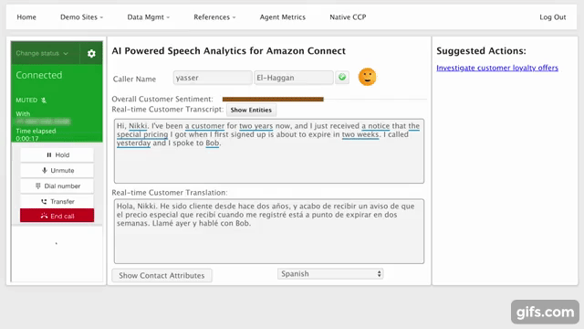
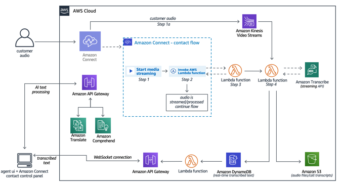

# AI Powered Speech Analytics for Amazon Connect Demo 


### [Demo Site](https://deloitte-ai-connect-demo-website.s3-ap-southeast-2.amazonaws.com/CCP/agentAssist.html)



### Architecture



### Useful Links to Solution Guides

1. [Demo video](https://www.youtube.com/watch?v=PvnbGpRcV64)
2. [Solutions guide](https://docs.aws.amazon.com/solutions/latest/ai-powered-speech-analytics-for-amazon-connect/components.html)
3. [Deployment steps](https://docs.aws.amazon.com/solutions/latest/ai-powered-speech-analytics-for-amazon-connect/deployment.html)
4. [Official Implementation Guide](https://s3.amazonaws.com/solutions-reference/AI-powered-speech-analytics-for-amazon-connect/latest/AI-powered-speech-analytics-for-amazon-connect.pdf)


## Running unit tests for customization

* Clone the repository, then make the desired code changes
* Next, run unit tests to make sure added customization passes the tests
```
cd ./deployment
chmod +x ./run-unit-tests.sh  \n
./run-unit-tests.sh \n
```

## Building distributable for customization
* Configure the bucket name of your target Amazon S3 distribution bucket
```
export DIST_OUTPUT_BUCKET=my-bucket-name # bucket where customized code will reside
export SOLUTION_NAME=my-solution-name
export VERSION=my-version # version number for the customized code
```
_Note:_ You would have to create an S3 bucket with the prefix 'my-bucket-name-<aws_region>'; aws_region is where you are testing the customized solution. Also, the assets in bucket should be publicly accessible.

* Now build the distributable:
```
chmod +x ./build-s3-dist.sh \n
./build-s3-dist.sh $DIST_OUTPUT_BUCKET $SOLUTION_NAME $VERSION \n
```

* Deploy the distributable to an Amazon S3 bucket in your account. _Note:_ you must have the AWS Command Line Interface installed.
```
aws s3 cp ./dist/ s3://my-bucket-name-<aws_region>/$SOLUTION_NAME/$VERSION/ --recursive --acl bucket-owner-full-control --profile aws-cred-profile-name \n
```

* Get the link of the solution template uploaded to your Amazon S3 bucket.
* Deploy the solution to your account by launching a new AWS CloudFormation stack using the link of the solution template in Amazon S3.

***

## File Structure

```
|-deployment/
  |-build-s3-dist.sh             [ shell script for packaging distribution assets ]
  |-run-unit-tests.sh            [ shell script for executing unit tests ]
  |-solution.yaml                [ solution CloudFormation deployment template ]
|-source/
  |-example-function-js          [ Example microservice function in javascript ]
    |- lib/                      [ Example function libraries ]
  |-example-function-py          [ Example microservice function in python ]

```

Each microservice follows the structure of:

```
|-service-name/
  |-lib/
    |-[service module libraries and unit tests]
  |-index.js [injection point for microservice]
  |-package.json
```

***


Copyright 2019 Amazon.com, Inc. or its affiliates. All Rights Reserved.

Licensed under the Apache License Version 2.0 (the "License"). You may not use this file except in compliance with the License. A copy of the License is located at

    http://www.apache.org/licenses/

or in the "license" file accompanying this file. This file is distributed on an "AS IS" BASIS, WITHOUT WARRANTIES OR CONDITIONS OF ANY KIND, express or implied. See the License for the specific language governing permissions and limitations under the License.
